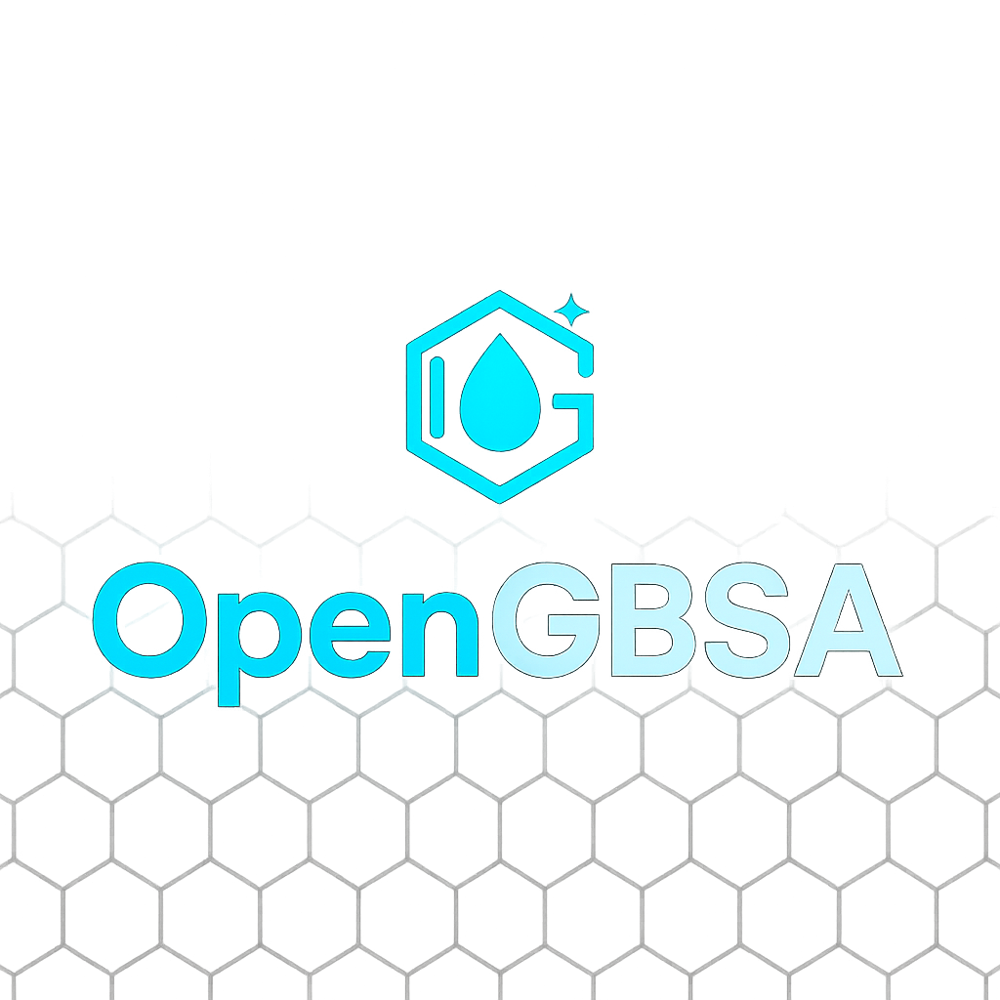

<div align="center">
  
  
  # OpenGBSA
  
  **Molecular Mechanics / Generalized Born Surface Area Analysis**
  
  [](https://opensource.org/licenses/MIT)
  [](https://www.python.org/downloads/)
  [](https://openmm.org/)
  [](https://github.com/Bio-Otto/opengbsa)
</div>

A comprehensive Molecular Mechanics/Generalized Born Surface Area (MM/GBSA) analysis package with advanced features including entropy analysis, per-residue decomposition, and YAML-based configuration.

**GitHub**: https://github.com/halilibrahimozdemir/opengbsa

## 🚀 Features

- **Multiple GB Models**: OBC2, OBC1, HCT, GBn, GBn2
- **Normal Mode Analysis**: Entropy calculations with ultra-robust minimization
- **Per-Residue Decomposition**: Detailed residue-ligand interaction analysis
- **YAML Configuration**: Single configuration file for all parameters
- **Advanced Validation**: Input validation and result quality checks
- **Parallel Processing**: Multi-core support for faster analysis
- **Caching System**: Reuse prepared systems for efficiency
- **Comprehensive Reporting**: Detailed analysis reports with plots

## 📋 Requirements

- Python 3.8+
- OpenMM 8.0+
- CUDA support (optional, for GPU acceleration)

## 🛠️ Installation

### Option 1: Using pip
```bash
pip install -r requirements.txt
```

### Option 2: Using conda/mamba
```bash
# Create new environment
conda create -n mmgbsa python=3.9
conda activate mmgbsa

# Install dependencies
conda install -c conda-forge openmm mdtraj openff-toolkit
pip install -r requirements.txt
```

### Option 3: Docker (coming soon)
```bash
# Docker image will be available soon
docker pull mmgbsa/analysis:latest
```

## 🎯 Quick Start

### 1. Create Configuration File
```bash
python mmgbsa_runner.py --create-config
```

This creates a sample `mmgbsa_config.yaml` file. Edit it with your specific parameters.

### 2. Run Analysis
```bash
python mmgbsa_runner.py mmgbsa_config.yaml
```

### 3. View Results
Results are saved in `mmgbsa_results/analysis_YYYYMMDD_HHMMSS/` with:
- `final_report.txt`: Comprehensive analysis report
- `results_summary.yaml`: Summary of all results
- `analysis_config.yaml`: Copy of used configuration
- Various plots and data files

## 📁 Input Files

Your YAML configuration should specify these input files:

```yaml
input_files:
  ligand_mol: "path/to/ligand.sdf"      # Ligand structure (SDF, MOL2)
  complex_pdb: "path/to/complex.pdb"    # Protein-ligand complex
  ligand_pdb: "path/to/ligand.pdb"      # Isolated ligand structure
  trajectory: "path/to/trajectory.xtc"  # MD trajectory (.xtc, .dcd, .trr)
```

## ⚙️ Configuration Options

### Complete Configuration (Recommended)
For full control and reproducibility, use the complete configuration file:

```bash
# Create complete configuration
python complete_mmgbsa_runner.py --create-config

# Run with complete configuration
python complete_mmgbsa_runner.py complete_mmgbsa_config.yaml
```

The complete configuration includes all parameters with alternatives in comments.

### Basic Analysis
```yaml
analysis_settings:
  temperature: 300                    # Temperature (K)
  gb_model: "OBC2"                   # GB model (OBC2, OBC1, HCT, GBn, GBn2)
  salt_concentration: 0.15           # Salt concentration (M)
  max_frames: 50                     # Number of trajectory frames
  use_cache: true                    # Enable caching
```

### Frame Selection
```yaml
analysis_settings:
  # Frame selection parameters
  max_frames: 50                     # Maximum frames to analyze
  frame_start: 100                   # Start frame (0-indexed), null = beginning
  frame_end: 1000                    # End frame (0-indexed), null = end
  frame_stride: 5                    # Every Nth frame, null = all frames
  frame_selection: "sequential"      # "sequential", "equidistant", "random"
  random_seed: 42                    # Random seed for random selection
```

### Advanced Features
```yaml
analysis_settings:
  run_entropy_analysis: true         # Enable entropy calculation
  run_per_residue_decomposition: true # Enable per-residue analysis
  decomp_frames: 10                  # Frames for decomposition
  energy_decomposition: false        # Energy component analysis
  parallel_processing: true          # Enable parallel processing
```

### Output Control
```yaml
output_settings:
  output_directory: "mmgbsa_results" # Output directory
  save_plots: true                   # Save generated plots
  save_trajectories: false           # Save processed trajectories
```

## 📊 Example Configurations

### Complete Configuration (Recommended)
For full control and reproducibility, use the complete configuration:

```bash
# Create complete configuration
python complete_mmgbsa_runner.py --create-config

# Run with complete configuration
python complete_mmgbsa_runner.py complete_mmgbsa_config.yaml
```

The complete configuration includes all parameters with alternatives in comments.

### Quick Analysis (Fast)
```yaml
analysis_settings:
  max_frames: 20
  frame_start: 500                   # Skip equilibration
  frame_stride: 10                   # Every 10th frame
  frame_selection: "sequential"
  run_entropy_analysis: false
  run_per_residue_decomposition: false
  use_cache: true
```

### Comprehensive Analysis (Detailed)
```yaml
analysis_settings:
  max_frames: 100
  run_entropy_analysis: true
  run_per_residue_decomposition: true
  decomp_frames: 20
  energy_decomposition: true
```

### Production Analysis (Balanced)
```yaml
analysis_settings:
  max_frames: 50
  frame_start: 1000                  # Skip equilibration
  frame_end: null                    # To end of trajectory
  frame_stride: 5                    # Every 5th frame
  frame_selection: "sequential"
  run_entropy_analysis: false
  run_per_residue_decomposition: true
  decomp_frames: 10
  use_cache: true
  parallel_processing: true
```

## 🔬 Analysis Types

### 1. Standard MM/GBSA
Calculates binding free energy using molecular mechanics and implicit solvation.

### 2. Entropy Analysis
Uses normal mode analysis to calculate vibrational entropy contributions.

### 3. Per-Residue Decomposition
Identifies which protein residues contribute most to binding.

### 4. Hot Spot Identification
Finds key binding hot spots for drug design.

## 📊 Frame Selection Strategies

### Sequential Selection
```yaml
frame_selection: "sequential"
frame_stride: 5                      # Every 5th frame
frame_start: 100                     # Start from frame 100
frame_end: 1000                      # End at frame 1000
```

### Equidistant Selection
```yaml
frame_selection: "equidistant"
max_frames: 30                       # Select exactly 30 frames
frame_start: 50                      # From frame 50
frame_end: 1000                      # To frame 1000
```

### Random Selection
```yaml
frame_selection: "random"
max_frames: 25                       # Select 25 random frames
frame_start: 200                     # From frame 200
frame_end: 800                       # To frame 800
frame_stride: 2                      # Only consider every 2nd frame
random_seed: 123                     # For reproducibility
```

### Production Analysis
```yaml
frame_start: 1000                    # Skip equilibration
frame_stride: 5                      # Every 5th frame
max_frames: 100                      # Maximum 100 frames
frame_selection: "sequential"
```

## 📈 Output Files

- **`final_report.txt`**: Comprehensive text report
- **`results_summary.yaml`**: Structured results data
- **`binding_energy_plot.png`**: Binding energy over time
- **`energy_distribution.png`**: Energy distribution histogram
- **`convergence_plot.png`**: Convergence analysis
- **`per_residue_contributions.csv`**: Per-residue energy contributions
- **`hot_spots.csv`**: Identified binding hot spots

## 🐛 Troubleshooting

### Common Issues

1. **Missing CUDA**: If CUDA is not available, the system will automatically fall back to CPU
2. **Memory Issues**: Reduce `max_frames` or `decomp_frames` for large systems
3. **File Format Issues**: Ensure trajectory files are compatible with MDTraj

### Warning Suppression

The package automatically suppresses common warnings:
- **OpenEye Toolkit warnings**: Normal if OpenEye is not installed (uses RDKit instead)
- **OpenMM deprecation warnings**: Handles both new and old OpenMM import styles
- **Other warnings**: General warning suppression for cleaner output

If you see warnings, they are informational and don't affect functionality.

### Validation Errors

The package includes comprehensive validation:
- Input file existence and format
- System preparation success
- Energy calculation convergence
- Result quality checks

## 🔧 Advanced Usage

### Command Line Options
```bash
# Create sample configuration
python mmgbsa_runner.py --create-config

# Create custom named configuration
python mmgbsa_runner.py --create-config --config-name my_config.yaml

# Run with specific configuration
python mmgbsa_runner.py my_config.yaml
```

### Programmatic Usage
```python
from mmgbsa_runner import MMGBSARunner

# Create runner
runner = MMGBSARunner('config.yaml')

# Run analysis
results = runner.run_analysis()

# Access results
binding_energy = results['mmgbsa']['mean_binding_energy']
```

## 📚 API Reference

### Main Classes

- `MMGBSARunner`: Main analysis runner
- `FixedEnhancedTrueForceFieldMMGBSA`: Core MM/GBSA calculator
- `PerResidueDecomposition`: Per-residue analysis
- `NormalModeAnalysis`: Entropy calculations

### Key Methods

- `run_analysis()`: Run complete analysis pipeline
- `run_enhanced()`: Run MM/GBSA with validation
- `run_per_residue_analysis()`: Run per-residue decomposition
- `run_ultra_robust_nma()`: Run entropy analysis

## 🤝 Contributing

1. Fork the repository
2. Create a feature branch
3. Make your changes
4. Add tests if applicable
5. Submit a pull request

## 📄 License

This project is licensed under the MIT License - see the LICENSE file for details.

## 🙏 Acknowledgments

- OpenMM development team
- OpenFF consortium
- MDTraj developers
- Scientific Python community

## 📞 Support

For issues and questions:
- Check the troubleshooting section
- Review the configuration examples
- Open an issue on GitHub

## 🔄 Version History

- **v0.0.4**: YAML configuration system, comprehensive runner
- **v0.0.3**: Per-residue decomposition, hot spot identification
- **v0.0.2**: Entropy analysis, ultra-robust NMA
- **v0.0.1**: Basic MM/GBSA implementation

## 🎨 Logo and Branding

OpenGBSA includes professional logos and branding materials:

- **Main Logo**: `assets/logo.png` - High-resolution logo for documentation
- **Vector Logo**: `assets/logo.svg` - Scalable vector format for web use
- **Simple Logo**: `assets/logo_simple.png` - Clean text-based logo
- **GitHub Banner**: `assets/github_banner.png` - Repository banner (1280x640)

### Logo Usage

The logos are available under the same MIT license as the software. You can use them for:
- Documentation and presentations
- Academic publications
- Conference materials
- Educational resources

### Custom Logo Generation

To generate custom logo variants, use the included logo generator:

```bash
python assets/logo_generator.py
```

This creates all logo variants with customizable colors and styles.

---

**Note**: This package is under active development. Please report any issues or suggest improvements! 